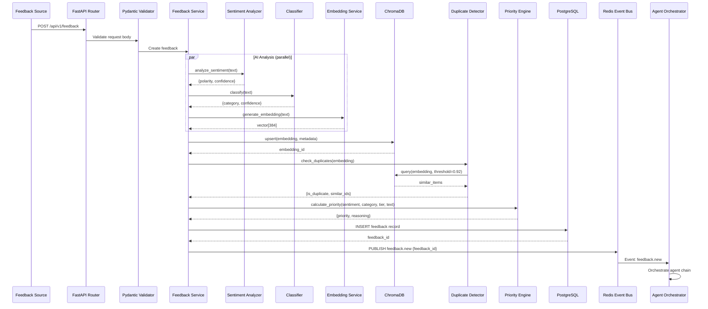
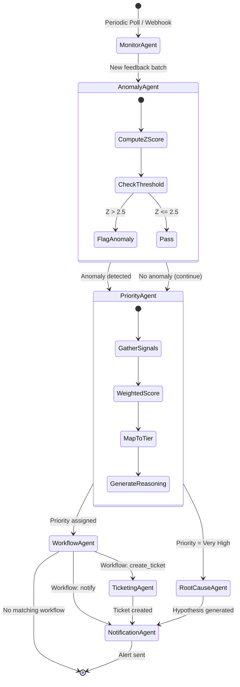
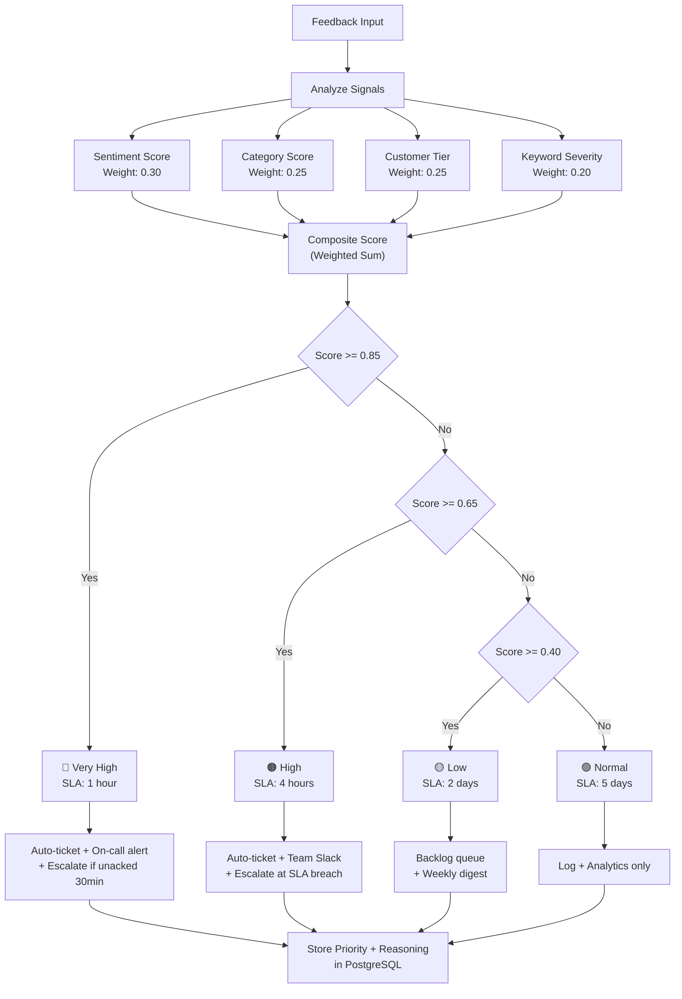
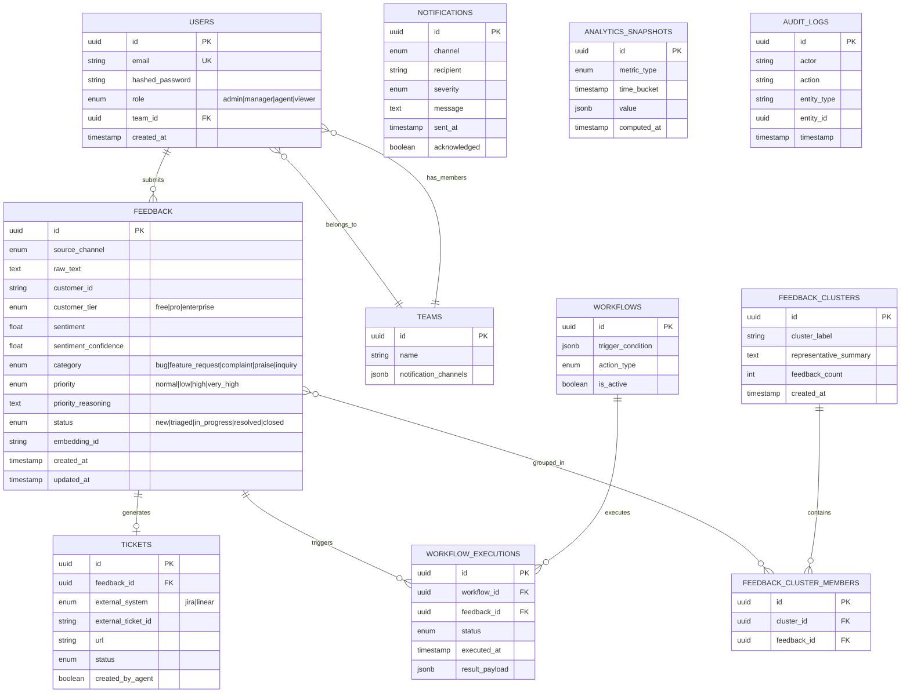
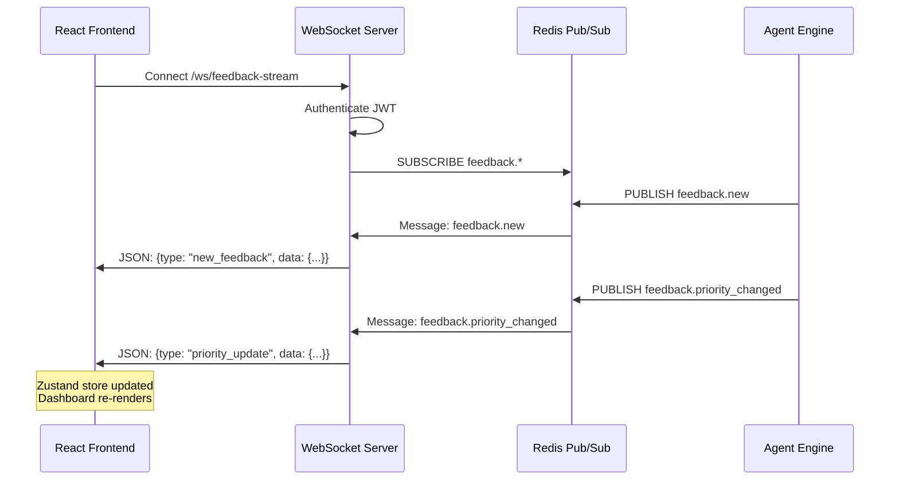
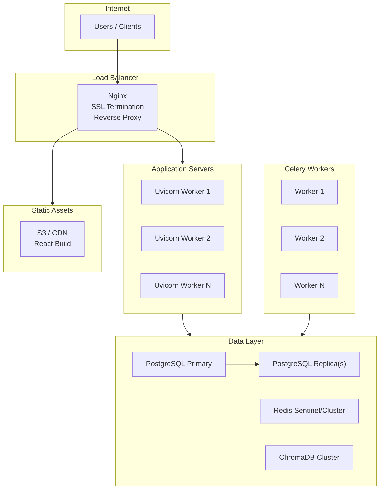

# EngageAI — Architecture Documentation

## System Architecture

### High-Level Overview

```mermaid
graph TB
    subgraph External["External Sources"]
        E1["Email Inbox"]
        E2["Widget Embed"]
        E3["REST API"]
        E4["CSV Upload"]
        E5["Webhook"]
    end

    subgraph Gateway["API Gateway Layer"]
        GW["FastAPI + Uvicorn"]
        RL["Rate Limiter<br/>(slowapi + Redis)"]
        AUTH["JWT Auth<br/>+ RBAC"]
        VAL["Pydantic v2<br/>Validation"]
    end

    subgraph Processing["Processing Pipeline"]
        direction TB
        ING["Ingestion Service"]
        AI_PIPE["AI Pipeline"]
        EMB_PIPE["Embedding Pipeline"]
    end

    subgraph AIServices["AI/ML Services"]
        S1["Sentiment<br/>VADER"]
        S2["Classification<br/>TF-IDF + LR"]
        S3["Topic Detection<br/>LDA"]
        S4["Summarization<br/>LLM/Extractive"]
        S5["Priority Engine<br/>Weighted Hybrid"]
        S6["Duplicate Detection<br/>Cosine Similarity"]
        S7["Clustering<br/>HDBSCAN"]
        S8["Trend Analysis<br/>Z-Score/EWMA"]
        S9["Feature Extraction<br/>LLM/Regex"]
        S10["Insights<br/>LLM/Template"]
        S11["NL Query<br/>LLM/Keyword"]
    end

    subgraph DataStores["Data Stores"]
        PG[("PostgreSQL<br/>Structured Data")]
        CV[("ChromaDB<br/>Vector Store")]
        RD[("Redis<br/>Cache + Pub/Sub")]
    end

    subgraph AgentEngine["Agentic Engine (Celery Workers)"]
        ORCH["Orchestrator"]
        A1["Monitor Agent"]
        A2["Anomaly Agent"]
        A3["Priority Agent"]
        A4["Workflow Agent"]
        A5["Ticketing Agent"]
        A6["Notification Agent"]
        A7["Root Cause Agent"]
    end

    subgraph Integrations["External Integrations"]
        JIRA["Jira API"]
        LIN["Linear API"]
        SLK["Slack API"]
        SMTP_OUT["SMTP Email"]
    end

    subgraph RealTime["Real-Time Delivery"]
        WS["WebSocket Server"]
        SSE["SSE Endpoint"]
    end

    subgraph Frontend["React Dashboard"]
        DASH["Dashboard"]
        FE["Feedback Explorer"]
        AN["Analytics"]
        AC["Agent Control"]
    end

    External --> Gateway
    Gateway --> Processing
    Processing --> AIServices
    AIServices <--> CV
    Processing --> PG
    PG <--> AgentEngine
    RD <--> AgentEngine
    AgentEngine --> Integrations
    AgentEngine --> RealTime
    RealTime --> Frontend
```

---

## Data Flow: Feedback Ingestion Pipeline

---

## Agent Orchestration Flow

---

## Priority Classification Flow

---

## Database Schema (ER Diagram)

---

## Real-Time Communication

---

## Deployment Architecture (Production)

