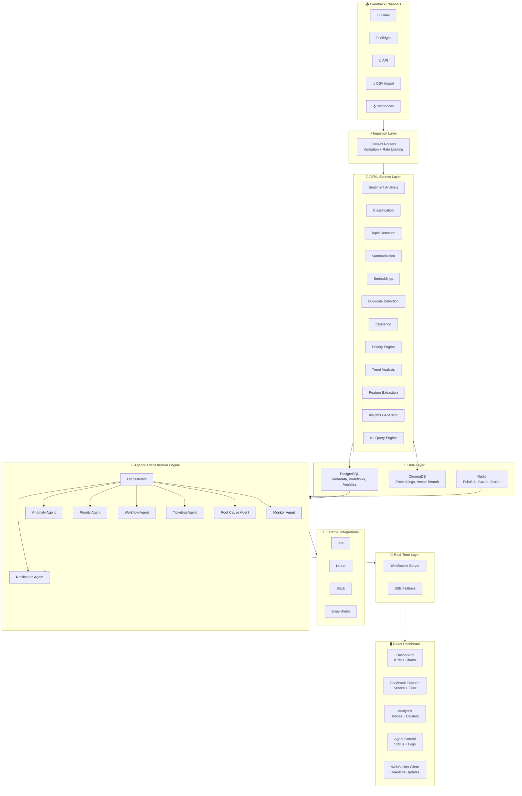

# 🧠 EngageAI — AI-Powered Customer Feedback Intelligence Platform

> **Ingest → Analyze → Act → Learn** — Autonomous feedback intelligence that turns customer noise into actionable signal.

[](LICENSE)
[](https://python.org)
[](https://react.dev)
[](https://fastapi.tiangolo.com)

---

## 📐 Architecture Overview



---

## 🚀 Quick Start

### Prerequisites

- [Docker](https://docs.docker.com/get-docker/) & [Docker Compose](https://docs.docker.com/compose/install/)
- (Optional) Node.js 18+ for local frontend development
- (Optional) Python 3.11+ for local backend development

### Setup

```bash
# 1. Clone the repository
git clone https://github.com/your-org/engageai.git
cd engageai

# 2. Copy environment variables
cp .env.example .env

# 3. Start all services
docker-compose up -d --build

# 4. Run database migrations
docker-compose exec backend alembic upgrade head

# 5. Seed demo data
docker-compose exec backend python -m infra.scripts.seed_data

# 6. Initialize ChromaDB collections
docker-compose exec backend python -m infra.scripts.init_chroma
```

Or use the one-command setup:

```bash
make setup
```

### Access Points

| Service          | URL                          |
|-----------------|------------------------------|
| Frontend         | http://localhost:3000         |
| Backend API      | http://localhost:8000         |
| API Documentation| http://localhost:8000/docs    |
| PostgreSQL       | localhost:5432               |
| Redis            | localhost:6379               |
| ChromaDB         | http://localhost:8001         |

### Demo Credentials

| Role    | Email                | Password  |
|---------|---------------------|-----------|
| Admin   | admin@engageai.io   | admin123  |
| Manager | manager@engageai.io | manager123|
| Agent   | agent@engageai.io   | agent123  |
| Viewer  | viewer@engageai.io  | viewer123 |

---

## 🏗️ Technology Stack

| Layer        | Technology                                    |
|-------------|----------------------------------------------|
| Frontend    | React 18, Tailwind CSS, Chart.js (react-chartjs-2), Zustand, Axios, React Router v6 |
| Backend     | FastAPI, Uvicorn, Pydantic v2, SQLAlchemy 2.0 (async) |
| Database    | PostgreSQL 16, ChromaDB 0.5                   |
| Cache/Queue | Redis 7, Celery 5                             |
| AI/ML       | sentence-transformers, scikit-learn, VADER, OpenAI/Anthropic (optional) |
| Infra       | Docker Compose, Nginx, Alembic               |

---

## 📁 Project Structure

```
engageai/
├── docker-compose.yml              # Service orchestration
├── docker-compose.override.yml     # Dev overrides
├── .env.example                    # Environment variable template
├── README.md                       # This file
├── ARCHITECTURE.md                 # Detailed architecture docs
├── Makefile                        # Common commands
│
├── backend/
│   ├── Dockerfile
│   ├── requirements.txt
│   ├── alembic.ini
│   ├── alembic/                    # Database migrations
│   ├── app/
│   │   ├── main.py                 # FastAPI app entrypoint
│   │   ├── core/                   # Config, security, logging, rate limiting
│   │   ├── db/                     # Database connections (Postgres, ChromaDB)
│   │   ├── models/                 # SQLAlchemy ORM models
│   │   ├── schemas/                # Pydantic v2 schemas
│   │   ├── api/v1/                 # REST API routers
│   │   ├── ai/                     # 12 AI/ML service modules
│   │   ├── agents/                 # 8 autonomous agents + orchestrator
│   │   ├── integrations/           # Jira, Linear, Slack, Email adapters
│   │   ├── services/               # Business logic services
│   │   └── websocket/              # Real-time connection manager
│   └── tests/
│
├── frontend/
│   ├── Dockerfile
│   ├── package.json
│   ├── tailwind.config.js
│   ├── vite.config.js
│   └── src/
│       ├── api/                    # Axios client + domain APIs
│       ├── store/                  # Zustand state management
│       ├── hooks/                  # Custom React hooks
│       ├── components/             # Reusable UI components
│       └── pages/                  # Application pages
│
└── infra/
    ├── nginx/                      # Reverse proxy config
    └── scripts/                    # Seed data, ChromaDB init
```

---

## 🔐 Environment Variables Reference

| Variable | Required | Default | Description |
|----------|----------|---------|-------------|
| `APP_ENV` | No | `development` | Application environment |
| `SECRET_KEY` | **Yes (prod)** | — | Application secret for signing |
| `DATABASE_URL` | Yes | (see .env.example) | PostgreSQL connection string |
| `REDIS_URL` | Yes | `redis://localhost:6379/0` | Redis connection string |
| `CHROMA_HOST` | Yes | `localhost` | ChromaDB host |
| `CHROMA_PORT` | Yes | `8001` | ChromaDB port |
| `JWT_SECRET_KEY` | **Yes (prod)** | — | JWT signing key |
| `JWT_ACCESS_TOKEN_EXPIRE_MINUTES` | No | `30` | Access token TTL |
| `JWT_REFRESH_TOKEN_EXPIRE_DAYS` | No | `7` | Refresh token TTL |
| `OPENAI_API_KEY` | No | — | OpenAI API key (enables LLM features) |
| `EMBEDDING_MODEL` | No | `all-MiniLM-L6-v2` | Sentence-transformer model |
| `PRIORITY_SENTIMENT_WEIGHT` | No | `0.30` | Priority engine: sentiment weight |
| `PRIORITY_CATEGORY_WEIGHT` | No | `0.25` | Priority engine: category weight |
| `PRIORITY_TIER_WEIGHT` | No | `0.25` | Priority engine: customer tier weight |
| `PRIORITY_KEYWORD_WEIGHT` | No | `0.20` | Priority engine: keyword weight |
| `JIRA_ENABLED` | No | `false` | Enable Jira integration |
| `SLACK_ENABLED` | No | `false` | Enable Slack integration |
| `EMAIL_ENABLED` | No | `false` | Enable email notifications |

See [.env.example](.env.example) for the complete list.

---

## 🤖 AI Features

| # | Feature | Module | Approach |
|---|---------|--------|----------|
| 1 | Sentiment Analysis | `ai/sentiment.py` | VADER + keyword scoring |
| 2 | Category Classification | `ai/classification.py` | TF-IDF + LogisticRegression |
| 3 | Topic Detection | `ai/topic_detection.py` | LDA topic modeling |
| 4 | Text Summarization | `ai/summarization.py` | LLM (GPT/Claude) + extractive fallback |
| 5 | Embeddings | `ai/embeddings.py` | sentence-transformers (all-MiniLM-L6-v2) |
| 6 | Duplicate Detection | `ai/duplicate_detection.py` | ChromaDB cosine similarity (≥0.92) |
| 7 | Feedback Clustering | `ai/clustering.py` | HDBSCAN/KMeans on embeddings |
| 8 | Priority Prediction | `ai/priority_engine.py` | Weighted hybrid: sentiment + keywords + tier + category |
| 9 | Trend Analysis | `ai/trend_analysis.py` | Rolling z-score + EWMA |
| 10 | Feature Request Extraction | `ai/feature_request_extractor.py` | LLM + regex patterns |
| 11 | Insights Generation | `ai/insights_generator.py` | LLM + template aggregation |
| 12 | Natural Language Queries | `ai/nl_query_engine.py` | LLM + keyword search fallback |

---

## 🔄 Priority Classification System

| Priority | Criteria | SLA | Routing |
|----------|----------|-----|---------|
| 🔴 Very High | Enterprise + negative sentiment + bug/outage keywords | 1 hour | Auto-ticket + Slack/email to on-call |
| 🟠 High | Negative sentiment + bug/complaint, or cluster growth | 4 hours | Auto-ticket + team Slack channel |
| 🟡 Low | Neutral sentiment, minor feature requests | 2 business days | Backlog queue, weekly digest |
| 🟢 Normal | Praise, general inquiries, low-impact | 5 business days | Logged + analytics only |

---

## 🏭 Production Deployment

### Scaling Recommendations

1. **Backend**: Run multiple Uvicorn workers behind Nginx load balancer
   ```yaml
   UVICORN_WORKERS=4  # Adjust based on CPU cores
   ```

2. **Celery Workers**: Scale horizontally by running additional worker containers
   ```bash
   docker-compose up -d --scale worker=4
   ```

3. **PostgreSQL**: Add read replicas for analytics queries; use PgBouncer for connection pooling

4. **ChromaDB**: For large-scale deployments, consider ChromaDB's distributed mode or migrate to a managed vector database (Pinecone, Weaviate)

5. **Redis**: Use Redis Sentinel or Redis Cluster for high availability

### Production Checklist

- [ ] Set strong `SECRET_KEY` and `JWT_SECRET_KEY`
- [ ] Change all default passwords
- [ ] Configure real SMTP, Slack, Jira credentials
- [ ] Enable HTTPS via Nginx with proper SSL certificates
- [ ] Set `APP_ENV=production` and `DEBUG=false`
- [ ] Configure log aggregation (ELK/CloudWatch/Datadog)
- [ ] Set up database backups and monitoring
- [ ] Review rate limiting thresholds for production traffic

---

## 📜 License

MIT License — see [LICENSE](LICENSE) for details.
